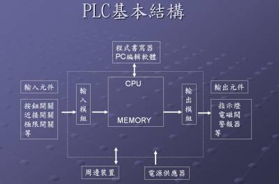
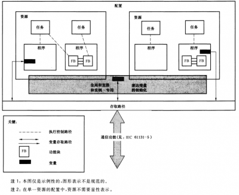

# PLC(Programmable Logic Controller)

一种具有微处理器的数字电子设备，用于自动化控制的数字逻辑控制器，可以将控制指令随时加载到存储器内存储与运行。

## PLC内部运行方式

`PLC`运行梯形图程序的运作方式是逐行的先将代码以扫描的方式读入内存，并最后运行控制运作。在整个的扫描过程包含三大步骤，“输入状态检查”、“程序运行”、“输出状态更新”。

- 输入状态检查
  

`PLC`首先检查输入端组件所连接各点开关或传感器状态，并将其状态写入存储器中对应的位置。

- 程序运行
  

将梯形图程序逐行运行，若程序运行中需要输入接点状态，CPU直接在存储器中查询取出。输出线圈运算结果则存入存储器对应的位置，暂不反应到输出端。

- 输出状态更新
  

将“程序运行”中的输出状态更新至`PLC`输出节点，并重回步骤1。

此三步骤称为**PLC扫描周期**，而完成一个周期所需的时间成为**PLC反应时间**，`PLC`输入信号时间若小于反应时间，则有误读的可能性。每次程序运行后与下一次程序运行前，输入输出状态会被更新一次，因此称该运行方式为**输入输出端程序结束再生**。



## PLC程序设计

[IEC 61131-3](https://zh.wikipedia.org/wiki/IEC61131)是一个国际标准，它规范了`PLC`相关之软件硬件的标准，其最终的目的是可以让PLC的用户在不更改软件设计的状况下可以轻易更换`PLC`硬件。`IEC 61131-3`主要是提供了五种编程语言，包含：

- 指令表(Instruction List, IL或Statement List, SL)
  
- 结构化文本(Structured Text, ST)
  
- 梯形图(Ladder Programming, LAD)
  
- 顺序功能流程图(Sequential Function Chart, SFC)
  
- 功能区块图(Function Block Diagram, FBD)
  

`IEC 61131-3`的国内标准为[GB-T15969.3](https://www.doc88.com/p-9833547915538.html)

## PLC的软件模型(IEC 61131-3)



### 配置(Configuration)

一个配置包含一个或多个资源，每个资源包含在零个或多个任务控制下执行的一个或多个程序。启动一个配置将使其全局变量进行初始化，随后启动配置中的所有资源。

### 资源(Resource)

启动一个资源将使资源内的所有变量初始化，接着使能资源中的所有任务。停止资源将导致其所有任务停止，配置的停止应导致其所有资源的停止。

### 任务(Task)

一个任务可以被引起执行，如：定时周期，一组程序的执行和功能模块实例。

### 程序(Program)

一个程序可以包含零个或多个功能块实例或由本部分定义副其他语言元素。

### 函数块(Function Block)

### 函数(Function)

### 参考地址

# OpenPLC

`OpenPLC`是一个[软PLC](https://baike.baidu.com/item/%E8%BD%AFPLC/9131739)的开源实现，遵循`IEC 61131-3`标准。`OpenPLC`整个项目包含三个部分:

- Runtime
  

编译、执行`PLC`程序

- Editor
  

编写调试`PLC`程序

- HMI Builder
  

人机界面，监控`PCL`设备，使用`ModBus`通讯

### Runtime

- 运行`webserver`
  
- 通过`webserver`接受到`start`命令，将上传的`st`文件编译生成`c`文件，并将生成的`c`文件与`runtime-core`一起比编译生成可执行文件`openplc`
  
- 编译生成的**c**文件主要提供`config_init__`函数和`config_run__`函数供`runtime-core`进行调用
  
- config_init__: 主要用于初始化工作
  
- config_run__: 主要是控制逻辑，在`runtime-core`主循环中被循环调用
  
- `webserver`运行`openplc`可执行文件
  

#### runtime-core

- 初始化硬件
  
- 保存输入输出状态
  
- 进入任务循环
  
- 更新输入状态
  
- 执行程序逻辑
  
- 更新输出状态
  

### Editor

编辑器的功能是将`IL、LAD、SFC、FBD`等格式的语言翻译生成ST格式的语言。

### HMI Builder

实时监控`OpenPLC`的`runtime`状态，使用`Modbus`协议与`runtime`通讯。

## ST语言示例编译解析(matiec解释器)

### Configuration
``` c
CONFIGURATION STD_CONF

  RESOURCE STD_RESSOURCE ON PLC
    TASK TaskMain(INTERVAL := T#50ms,PRIORITY := 0);
    PROGRAM Inst0 WITH TaskMain : My_Program;
    PROGRAM Inst_1 WITH TaskMain : My_Program_1;
  END_RESOURCE
END_CONFIGURATION

void config_init__(void) {
  BOOL retain;
  retain = 0;
 
  STD_RESSOURCE_init__();
}
 
void config_run__(unsigned long tick) {
  STD_RESSOURCE_run__(tick);
}
```

### Ressource

```c
RESOURCE STD_RESSOURCE ON PLC
    TASK TaskMain(INTERVAL := T#50ms,PRIORITY := 0);
    PROGRAM Inst0 WITH TaskMain : My_Program;
    PROGRAM Inst_1 WITH TaskMain : My_Program_1;
END_RESOURCE

void STD_RESSOURCE_init__(void) {
  BOOL retain;
  retain = 0;
 
  TASKMAIN = __BOOL_LITERAL(FALSE);
  MY_PROGRAM_init__(&INST0,retain);
  MY_PROGRAM_1_init__(&INST_1,retain);
}
 
void STD_RESSOURCE_run__(unsigned long tick) {
  TASKMAIN = !(tick % 1);
  if (TASKMAIN) {
    MY_PROGRAM_body__(&INST0);
  }
  if (TASKMAIN) {
    MY_PROGRAM_1_body__(&INST_1);
  }
}
```

### Program

```c
PROGRAM My_Program_1
  VAR CONSTANT
    SP : REAL := 15.0;
    KP : REAL := 1.0;
    KI : REAL := 0.1;
    KD : REAL := 0.2;
  END_VAR
  VAR
    PV_ADC AT %IW0.1 : INT := 0;
    MV_ADC AT %QW0.0 : INT := 0;
  END_VAR
  VAR CONSTANT
    ADC_MIN : INT := 0;
    ADC_MAX : INT := 255;
    TEMP_MIN : REAL := 0.0;
    MV_MIN : REAL := 0.0;
    PWM_MIN : REAL := 0.0;
    TEMP_MAX : REAL := 85.0;
    MV_MAX : REAL := 100.0;
    PWM_MAX : REAL := 255.0;
  END_VAR
  VAR
    myPID0 : myPID;
    Scale0 : Scale;
    Scale1 : Scale;
    INT_TO_REAL3_OUT : REAL;
    INT_TO_REAL4_OUT : REAL;
    INT_TO_REAL30_OUT : REAL;
    REAL_TO_INT31_OUT : INT;
  END_VAR

  INT_TO_REAL3_OUT := INT_TO_REAL(ADC_MIN);
  INT_TO_REAL4_OUT := INT_TO_REAL(ADC_MAX);
  INT_TO_REAL30_OUT := INT_TO_REAL(PV_ADC);
  Scale0(InMin := INT_TO_REAL3_OUT, InMax := INT_TO_REAL4_OUT, OutMin := TEMP_MIN, OutMax := TEMP_MAX, In := INT_TO_REAL30_OUT);
  myPID0(SP := SP, PV := Scale0.Out, KP := KP, KI := KI, KD := KD);
  Scale1(InMin := MV_MIN, InMax := MV_MAX, OutMin := PWM_MIN, OutMax := PWM_MAX, In := myPID0.MV);
  REAL_TO_INT31_OUT := REAL_TO_INT(Scale1.Out);
  MV_ADC := REAL_TO_INT31_OUT;
END_PROGRAM

void MY_PROGRAM_init__(MY_PROGRAM *data__, BOOL retain) {
  __INIT_VAR(data__->SP,15.0,retain)
  __INIT_VAR(data__->KP,1.0,retain)
  __INIT_VAR(data__->KI,0.1,retain)
  __INIT_VAR(data__->KD,0.2,retain)
  __INIT_LOCATED(INT,__IW0_1,data__->PV_ADC,retain)
  __INIT_LOCATED_VALUE(data__->PV_ADC,0)
  __INIT_LOCATED(INT,__QW0_0,data__->MV_ADC,retain)
  __INIT_LOCATED_VALUE(data__->MV_ADC,0)
  __INIT_VAR(data__->ADC_MIN,0,retain)
  __INIT_VAR(data__->ADC_MAX,255,retain)
  __INIT_VAR(data__->TEMP_MIN,0.0,retain)
  __INIT_VAR(data__->MV_MIN,0.0,retain)
  __INIT_VAR(data__->PWM_MIN,0.0,retain)
  __INIT_VAR(data__->TEMP_MAX,85.0,retain)
  __INIT_VAR(data__->MV_MAX,100.0,retain)
  __INIT_VAR(data__->PWM_MAX,255.0,retain)
  MYPID_init__(&data__->MYPID0,retain);
  SCALE_init__(&data__->SCALE0,retain);
  SCALE_init__(&data__->SCALE1,retain);
  __INIT_VAR(data__->INT_TO_REAL3_OUT,0,retain)
  __INIT_VAR(data__->INT_TO_REAL4_OUT,0,retain)
  __INIT_VAR(data__->INT_TO_REAL30_OUT,0,retain)
  __INIT_VAR(data__->REAL_TO_INT31_OUT,0,retain)
}
 
// Code part
void MY_PROGRAM_body__(MY_PROGRAM *data__) {
  // Initialise TEMP variables
 
  __SET_VAR(data__->,INT_TO_REAL3_OUT,,INT_TO_REAL(
    (BOOL)__BOOL_LITERAL(TRUE),
    NULL,
    (INT)__GET_VAR(data__->ADC_MIN,)));
  __SET_VAR(data__->,INT_TO_REAL4_OUT,,INT_TO_REAL(
    (BOOL)__BOOL_LITERAL(TRUE),
    NULL,
    (INT)__GET_VAR(data__->ADC_MAX,)));
  __SET_VAR(data__->,INT_TO_REAL30_OUT,,INT_TO_REAL(
    (BOOL)__BOOL_LITERAL(TRUE),
    NULL,
    (INT)__GET_LOCATED(data__->PV_ADC,)));
  __SET_VAR(data__->SCALE0.,INMIN,,__GET_VAR(data__->INT_TO_REAL3_OUT,));
  __SET_VAR(data__->SCALE0.,INMAX,,__GET_VAR(data__->INT_TO_REAL4_OUT,));
  __SET_VAR(data__->SCALE0.,OUTMIN,,__GET_VAR(data__->TEMP_MIN,));
  __SET_VAR(data__->SCALE0.,OUTMAX,,__GET_VAR(data__->TEMP_MAX,));
  __SET_VAR(data__->SCALE0.,IN,,__GET_VAR(data__->INT_TO_REAL30_OUT,));
  SCALE_body__(&data__->SCALE0);
  __SET_VAR(data__->MYPID0.,SP,,__GET_VAR(data__->SP,));
  __SET_VAR(data__->MYPID0.,PV,,__GET_VAR(data__->SCALE0.OUT,));
  __SET_VAR(data__->MYPID0.,KP,,__GET_VAR(data__->KP,));
  __SET_VAR(data__->MYPID0.,KI,,__GET_VAR(data__->KI,));
  __SET_VAR(data__->MYPID0.,KD,,__GET_VAR(data__->KD,));
  MYPID_body__(&data__->MYPID0);
  __SET_VAR(data__->SCALE1.,INMIN,,__GET_VAR(data__->MV_MIN,));
  __SET_VAR(data__->SCALE1.,INMAX,,__GET_VAR(data__->MV_MAX,));
  __SET_VAR(data__->SCALE1.,OUTMIN,,__GET_VAR(data__->PWM_MIN,));
  __SET_VAR(data__->SCALE1.,OUTMAX,,__GET_VAR(data__->PWM_MAX,));
  __SET_VAR(data__->SCALE1.,IN,,__GET_VAR(data__->MYPID0.MV,));
  SCALE_body__(&data__->SCALE1);
  __SET_VAR(data__->,REAL_TO_INT31_OUT,,REAL_TO_INT(
    (BOOL)__BOOL_LITERAL(TRUE),
    NULL,
    (REAL)__GET_VAR(data__->SCALE1.OUT,)));
  __SET_LOCATED(data__->,MV_ADC,,__GET_VAR(data__->REAL_TO_INT31_OUT,));
 
  goto __end;
 
__end:
  return;
} // MY_PROGRAM_body__() 
```

### Function Block

```c
FUNCTION_BLOCK myPID
  VAR_INPUT
    SP : REAL := 0.0;
    PV : REAL := 0.0;
  END_VAR
  VAR_OUTPUT
    MV : REAL := 0.0;
  END_VAR
  VAR
    ERROR : REAL := 0.0;
    ERROR_ANT : REAL := 0.0;
  END_VAR
  VAR_INPUT
    KP : REAL := 0.0;
    KI : REAL := 0.0;
    KD : REAL := 0.0;
  END_VAR
  VAR
    DERROR : REAL := 0.0;
    IERROR : REAL := 0.0;
  END_VAR

  ERROR := SP - PV;


  MV := KP*ERROR + KI*IERROR + KD*DERROR;

  DERROR := ERROR - ERROR_ANT;
  IERROR := IERROR + ERROR;

  ERROR_ANT := ERROR;
END_FUNCTION_BLOCK

void MYPID_init__(MYPID *data__, BOOL retain) {
  __INIT_VAR(data__->EN,__BOOL_LITERAL(TRUE),retain)
  __INIT_VAR(data__->ENO,__BOOL_LITERAL(TRUE),retain)
  __INIT_VAR(data__->SP,0.0,retain)
  __INIT_VAR(data__->PV,0.0,retain)
  __INIT_VAR(data__->MV,0.0,retain)
  __INIT_VAR(data__->ERROR,0.0,retain)
  __INIT_VAR(data__->ERROR_ANT,0.0,retain)
  __INIT_VAR(data__->KP,0.0,retain)
  __INIT_VAR(data__->KI,0.0,retain)
  __INIT_VAR(data__->KD,0.0,retain)
  __INIT_VAR(data__->DERROR,0.0,retain)
  __INIT_VAR(data__->IERROR,0.0,retain)
}
 
// Code part
void MYPID_body__(MYPID *data__) {
  // Control execution
  if (!__GET_VAR(data__->EN)) {
    __SET_VAR(data__->,ENO,,__BOOL_LITERAL(FALSE));
    return;
  }
  else {
    __SET_VAR(data__->,ENO,,__BOOL_LITERAL(TRUE));
  }
  // Initialise TEMP variables
 
  __SET_VAR(data__->,ERROR,,(__GET_VAR(data__->SP,) - __GET_VAR(data__->PV,)));
  __SET_VAR(data__->,MV,,(((__GET_VAR(data__->KP,) * __GET_VAR(data__->ERROR,)) + (__GET_VAR(data__->KI,) * __GET_VAR(data__->IERROR,))) + (__GET_VAR(data__->KD,) * __GET_VAR(data__->DERROR,))));
  __SET_VAR(data__->,DERROR,,(__GET_VAR(data__->ERROR,) - __GET_VAR(data__->ERROR_ANT,)));
  __SET_VAR(data__->,IERROR,,(__GET_VAR(data__->IERROR,) + __GET_VAR(data__->ERROR,)));
  __SET_VAR(data__->,ERROR_ANT,,__GET_VAR(data__->ERROR,));
 
  goto __end;
 
__end:
  return;
} // MYPID_body__() 
```

# 参考文献

* <https://zhuanlan.zhihu.com/p/344976570>
* <https://www.eefocus.com/embedded/253014>
* <https://download.schneider-electric.com/files?p_enDocType=White+Paper&p_File_Name=OnePage+-+Structured+Text+v1_4_1.pdf&p_Doc_Ref=IEC_61131-3>
* <https://repositorio-aberto.up.pt/bitstream/10216/102541/2/179524.pdf>
* <https://www.researchgate.net/publication/220055321_Analysis_and_implementation_of_the_IEC_61131-3_software_model_under_POSIX_Real-Time_operating_systems>
* <https://www.motioncontroltips.com/what-are-program-organization-units-in-plc-programming/>
* <https://core.ac.uk/download/pdf/289940446.pdf>
* <https://www.panasonic-electric-works.com/cps/rde/xbcr/pew_eu_en/dd_iec61131_basics_en.pdf>
* <https://download.lenze.com/TD/DDS__Drive%20PLC%20Developer%20Studio%20IEC61131-3%20programming__v2-0__EN.pdf>

