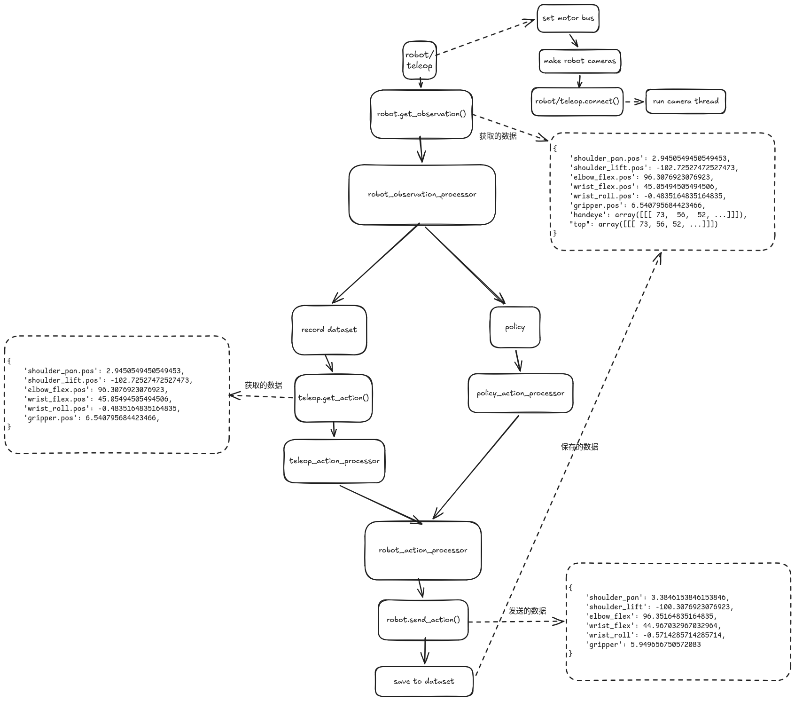

#+title: Lerobot
#+author: taocheng
#+date: <2026-04-10 Fri>
#+OPTIONS: ^:nil

机器人：SO101，包含从臂和主臂
Lerobot：v0.5.1

* 查询主从臂的串口号

#+begin_src
  lerobot-find-port # 先将机械臂串口插入，运行该命令，然后根据提示拔出串口
#+end_src

* 校准机械臂

校准时， *必须* 将所有的关节位置放置在 *中位* ，然后键盘的回车键进行校准。

** 校准主臂 (leader)

#+begin_src bash
  lerobot-calibrate \
      --teleop.id=leader \
      --teleop.type=so101_leader \
      --teleop.port=/dev/ttyACM0
#+end_src

** 校准从臂 (follower)

#+begin_src bash
  lerobot-calibrate \
      --robot.id=follower \
      --robot.type=so101_follower \
      --robot.port=/dev/ttyACM1
#+end_src

** 校准原理

SO101 有 6 个 DOF，每个关节都需要被校准。主要记录每个关节的最小和最大位置。

*** 电机配置

- range_mins: 电机运动范围的最小值
- range_maxes: 电机运动范围的最大值
- homing_offsets: 归位偏移量，指电机从物理零点位置到校准零点位置的偏移量

| 电机名称       | id | drive_mode | range_mins | range_maxes | homing_offsets | 归一化模式    |
| shoulder_pan  |  1 |          0 | 根据实际硬件 | 根据实际硬件  | 根据实际硬件     | degrees     |
| shoulder_lift |  2 |          0 | 根据实际硬件 | 根据实际硬件  | 根据实际硬件     | degrees     |
| elbow_flex    |  3 |          0 | 根据实际硬件 | 根据实际硬件  | 根据实际硬件     | degrees     |
| wrist_flex    |  4 |          0 | 根据实际硬件 | 根据实际硬件  | 根据实际硬件     | degrees     |
| wrist_roll    |  5 |          0 | 0          | 4096        | 根据实际硬件     | degrees     |
| gripper       |  6 |          0 | 根据实际硬件 | 根据实际硬件  | 根据实际硬件     | range_0_100 |

** 归一化原理

*读取* 电机数据时会进行 *归一化* 处理， *写入* 电机数据时会进行 *反归一化*

#+begin_src c
  min_ = range_min
  max_ = range_max
  bounded_val = min(max_, max(min_, val))

  // 电机分辨率
  MODEL_RESOLUTION = {
      "sts_series": 4096,
      "sms_series": 4096,
      "scs_series": 1024,
      "sts3215": 4096,
      "sts3250": 4096,
      "sm8512bl": 4096,
      "scs0009": 1024,
  }
#+end_src

- range_m100_100 模式
  #+begin_src c
    norm = (((bounded_val - min_) / (max_ - min_)) * 200) - 100
    normalized_values[id_] = -norm if drive_mode else norm
  #+end_src
  
- range_0_100 模式
  #+begin_src c
    norm = ((bounded_val - min_) / (max_ - min_)) * 100
    normalized_values[id_] = 100 - norm if drive_mode else norm
  #+end_src

- degrees 模式
  #+begin_src 
    mid = (min_ + max_) / 2
    max_res = self.model_resolution_table[self._id_to_model(id_)] - 1
    normalized_values[id_] = (val - mid) * 360 / max_res
  #+end_src
     

* 遥操作

#+begin_src bash
  lerobot-teleoperate \
      --teleop.id=leader \
      --teleop.type=so101_leader \
      --teleop.port=/dev/ttyACM0 \
      --robot.id=follower \
      --robot.type=so101_follower \
      --robot.port=/dev/ttyACM1
#+end_src

* 查询摄像头

#+begin_src bash
  lerobot-find-cameras opencv

  # --- Detected Cameras ---
  # Camera #0:
  #   Name: OpenCV Camera @ /dev/video0
  #   Type: OpenCV
  #   Id: /dev/video0
  #   Backend api: V4L2
  #   Default stream profile:
  #     Format: 0.0
  #     Fourcc: YUYV
  #     Width: 640
  #     Height: 480
  #     Fps: 30.0
  # --------------------
  # 
  # Finalizing image saving...
  # Image capture finished. Images saved to outputs/captured_images
#+end_src

* 实时显示画面的遥操作

#+begin_src bash
  lerobot-teleoperate \
      --teleop.id=leader \
      --teleop.type=so101_leader \
      --teleop.port=/dev/ttyACM0 \
      --robot.id=follower \
      --robot.type=so101_follower \
      --robot.port=/dev/ttyACM1 \
      --robot.cameras="{handeye: {type: opencv, index_or_path: /dev/video0, width: 640, height: 480, fps: 30}, top: {type: opencv, index_or_path: /dev/video2, width: 640, height: 480, fps: 30}}" \
      --display_data=true
#+end_src

* 收集数据

#+begin_src bash
  lerobot-record \
      --teleop.id=leader \
      --teleop.type=so101_leader \
      --teleop.port=/dev/ttyACM0 \
      --robot.id=follower \
      --robot.type=so101_follower \
      --robot.port=/dev/ttyACM1 \
      --robot.cameras="{handeye: {type: opencv, index_or_path: 0, width: 640, height: 480, fps: 30, fourcc: "MJPG"}, top: {type: opencv, index_or_path: 2, width: 640, height: 480, fps: 30, fourcc: "MJPG"}}" \
      --dataset.repo_id=taocheng/so101 \
      --dataset.num_episodes=5 \
      --dataset.single_task="Pick cube" \
      --dataset.streaming_encoding=true \
      --dataset.push_to_hub=false
#+end_src

** 收集数据的过程

#+NAME: fig:Lerobot record 流程

* 回放数据

#+begin_src bash
  lerobot-replay \
      --robot.id=follower \
      --robot.type=so101_follower \
      --robot.port=/dev/ttyACM1 \
      --dataset.repo_id=taocheng/so101 \
      --dataset.episode=0
#+end_src

* 训练

#+begin_src bash
  lerobot-train \
      --dataset.repo_id=taocheng/so101 \
      --policy.type=act \
      --output_dir=outputs/train/act_so101 \
      --policy.device=cuda \
      --wandb.enable=false \
      --policy.repo_id=taocheng/so101_act_policy
#+end_src

** 恢复训练

#+begin_src bash
  lerobot-train \
    --config_path=outputs/train/act_so101/checkpoints/last/pretrained_model/train_config.json \
    --resume=true
#+end_src

* 模型评估

#+begin_src bash
  lerobot-record \
      --teleop.id=leader \
      --teleop.type=so101_leader \
      --teleop.port=/dev/ttyACM0 \
      --robot.id=follower \
      --robot.type=so101_follower \
      --robot.port=/dev/ttyACM1 \
      --robot.cameras="{front: {type: opencv, index_or_path: 2, width: 640, height: 480, fps: 30}}" \
      --dataset.repo_id=taocheng/eval_so101 \ # 录制评估数据集
      --dataset.num_episodes=10 \
      --dataset.single_task="Pick cube" \
      --dataset.streaming_encoding=true \
      --dataset.push_to_hub=false \
      --policy.path=outputs/train/act_so101/checkpoints/100000/pretrained_model \ # 训练的模型路径
      --display_data=true
#+end_src

